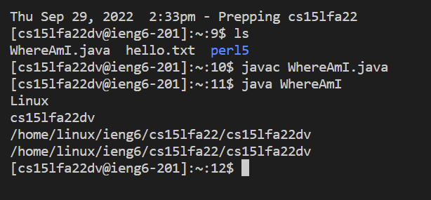

# Lab Report 2 - Week 1
**Step 1: Visual Studio Code**  
Since I had already installed VS code during my CSE 11 class, I was able to skip the installation. However in order to install VS code just go to the website, where you will download and install VS code. The final result of openning VS code should be a window similar to the one below.  
  

**Step 2: Connecting Remotely**  
In order to connect remotely you must get you class account and then open a new terminal in VS Code. In the terminal type the ssh command which will be similar to  
> ssh accountName@ieng6.ucsd.edu   

and the terminal will give a prompt to say yes to and then ask for a password. This password should be your UCSD password, however, if this doesn't work you will have to reset your password, which could take up to an hour.  
  
The above picture contains messages about the failed password attempts.
  

**Step 3: Using Commands**  
After successfully connecting remotely, we can run some commands in order to see what files are on the remote computer. Some commands that we can run include ls, cp, cp ~, and cat /home/linux/ieng6/cs15lfa22/public/hello.txt. In the screenshot below you can see that I ran cat to print out the hello.txt file and other commands.  
  

**Part 4: Transferring to Remote Computer**  
To transfer files from the client to the remote computer we will use the scp command. Note: log out of remote computer using "exit" command.  
> scp fileName accountName@ieng6.ucsd.edu:~/  

Use the above command with the file you want to transfer. This will prompt you to input your password, at which point the file will then be on your remote computer. 
  
  

**Part 5: Setting SSH Key**  
A SSH key will allow you to access SSH without having to input a password everytime. In order to create a SSH key run ssh-keygen command. Then transfer the public key to the remote computer using scp.   
  
When attempting to do the ssh-add for windows I ran into trouble when figuring out where to add the public key and how it would be used to aid in not needing a password.  
  

**Part 6: Optimization**  
When running the terminal you can use more optimal and efficient commands in order to save time and key strokes. I ran some efficient commands as seen in the picture, such as "ls" at the end of ssh command to see the directory and using semi-colons to run multiple commands.  

  
