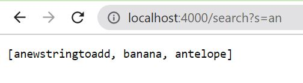
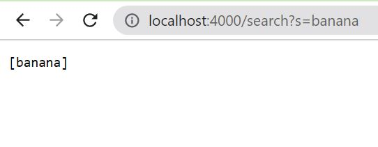

# Lab Report 3 - Week 3
## Part 1: Simplest Search Engine  
The following code is the implementation for the simplest search engine.  
```
# code block - Search Engine
import java.io.IOException;
import java.net.URI;
import java.util.ArrayList;

class Handler implements URLHandler {
    // The one bit of state on the server: a number that will be manipulated by
    // various requests.
    ArrayList<String> strArrL = new ArrayList<>();

    public String handleRequest(URI url) {
        ArrayList<String> printArr = new ArrayList<>();
        if (url.getPath().equals("/")) {
            for(int i = 0; i < strArrL.size(); i++) {
                printArr.add(strArrL.get(i));
            }
            return printArr.toString();
        } else if (url.getPath().equals("/search")) {
            System.out.println("Path: " + url.getPath());
            String[] parameters = url.getQuery().split("=");
            if (parameters[0].equals("s")) {
                for(int i = 0; i < strArrL.size(); i++) {
                    if(strArrL.get(i).contains(parameters[1])) {
                        printArr.add(strArrL.get(i));
                    }
                }
                return printArr.toString();
            }
            return "Not valid";
        } else {
            System.out.println("Path: " + url.getPath());
            if (url.getPath().contains("/add")) {
                String[] parameters = url.getQuery().split("=");
                if (parameters[0].equals("s")) {
                    strArrL.add((parameters[1]));
                    return String.format("%s was added", parameters[1]);
                }
            }
            return "404 Not Found!";
        }
    }
}

class SearchEngine {
    public static void main(String[] args) throws IOException {
        if(args.length == 0){
            System.out.println("Missing port number! Try any number between 1024 to 49151");
            return;
        }

        int port = Integer.parseInt(args[0]);

        Server.start(port, new Handler());
    }
}
```   
  
The method being called in this screenshot is the handleRequest method. This method takes a URI as the argument, which is the url. The method then looks for / in the url and that determines what code with run and what will print to the screen. In this example the code sees that the url contains /add, and then takes the query which is the information after ?. For this example the query is s=banana, then the .split("=") method is called and creates this array: ["s", "banana"]. Index 1 of this array is then added to the overall Array List of strings against which searches are compared.  

  
The handleRequest method is called, however the /search part of the url makes a different section of the code run. For this example the code sees the /search in the url and splits the query based on the location of =. If the search is executed correctly then index 0 of this array is s and index 1 is the search value. In this case the array is: ["s", "an"]. Then if index 0 of that array equals "s" then the code checks if any strings in strArrL (the Array List where strings are added using /add?s=WordWeWantToAdd) contains index 1 of the array. If the search value is contained in the string then that string is added to an Array List and printed to the screen. In this example the strings "anewstringtoadd", "banana", and "antelope" all contain "an". The Array List with these strings is then printed to the web page.  

  
The url in this screenshot will execute very similarly to the screenshot above it. The handleRequest method is called again and then the code associated with /search is run. This will create an array based off of the = for the query. In this case index 1 is "banana" and the code searches the stored strings to see if any contain "banana". Since there is only one string contains "banana" it is the only string printed to the screen. In this case "banana" is that word and is thus printed to the screen.  

## Part 2: Bugs From Different Files  
**ArrayExamples File**  
```
# Failure Inducing Input
@Test
public void testAverageWithoutLowest() {
    double[] input1 = {2.0, 2.0};
    assertEquals(2.0, ArrayExamples.averageWithoutLowest(input1), .05);
}
``` 
Symptom:  
  
```
# Code with the bug
static double averageWithoutLowest(double[] arr) {
    if(arr.length < 2) { return 0.0; }
    double lowest = arr[0];
    for(double num: arr) {
      if(num < lowest) { lowest = num; }
    }
    double sum = 0;
    for(double num: arr) {
      // the error occurs at this line
      // if there are multiple numbers that are equal
      // to the lowest then they are not added to the sum
      if(num != lowest) { sum += num; }
    }
    return sum / (arr.length - 1);
  }
```  
The bug is that there is only one lowest number, but if there are multiple numbers equal to that lowest number then those numbers are not added to the sum either.
```
# The fixed code
static double averageWithoutLowest(double[] arr) {
    if(arr.length < 2) { return 0.0; }
    double lowest = arr[0];
    for(double num: arr) {
      if(num < lowest) { lowest = num; }
    }
    double sum = 0;
    boolean lowestFound = false;
    for(double num: arr) {
      if((num != lowest) || lowestFound) { sum += num; }
      else { lowestFound = true; }
    }
    return sum / (arr.length - 1);
  }
```  
This bug will occur for any input where the lowest number occurs multiple times in the input array. The symptom from this bug is an average that appears to be lower than the expected average.  

**ListExamples File**  
```
# Failure Inducing Input
@Test
public void testFilter() {
    CheckerContainsB sc = new CheckerContainsB();
    List<String> arr = new ArrayList<>();
    arr.add("and");
    arr.add("hello");
    arr.add("padres");
    List<String> expectedArr = new ArrayList<>();
    expectedArr.add("and");
    expectedArr.add("padres");
    assertEquals(expectedArr, ListExamples.filter(arr, sc));
}
```  
Symptom:  
  
```
# Code with the bug
static List<String> filter(List<String> list, StringChecker sc) {
    List<String> result = new ArrayList<>();
    for(String s: list) {
      if(sc.checkString(s)) {
        // The error occurs here
        // Since string is being added to index 0
        // the returned List will be reversed
        result.add(0, s);
      }
    }
    return result;
}
```  
The bug was adding the string to the front of the list, which inverted the list.  
```
# The fixed code
static List<String> filter(List<String> list, StringChecker sc) {
    List<String> result = new ArrayList<>();
    for(String s: list) {
      if(sc.checkString(s)) {
        result.add(s);
      }
    }
    return result;
}
```  
The symptom of this bug was having return lists that whose values were reversed. Therefore, for any input lists that have more that one value that are true for the checkString method it will be reversed.