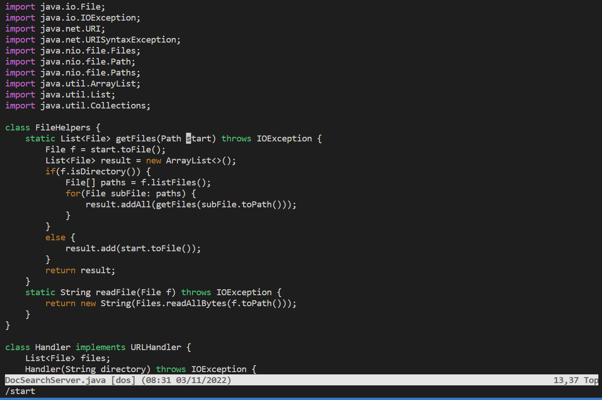
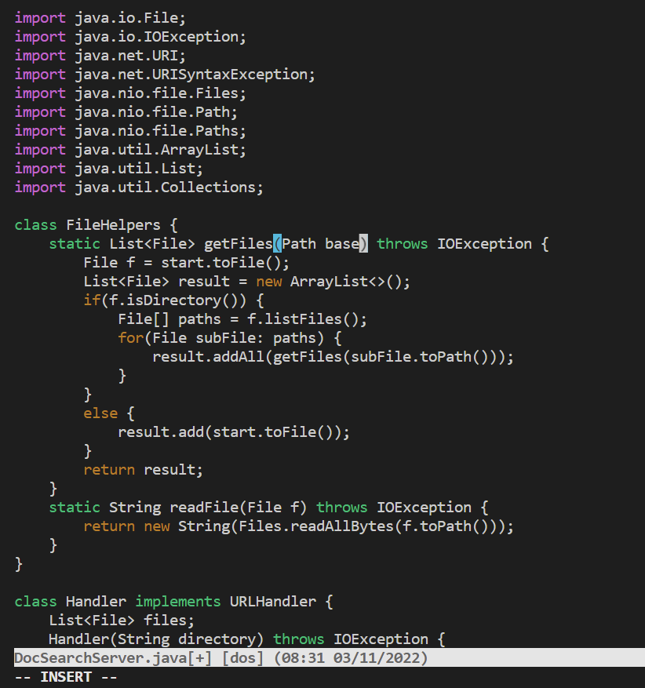
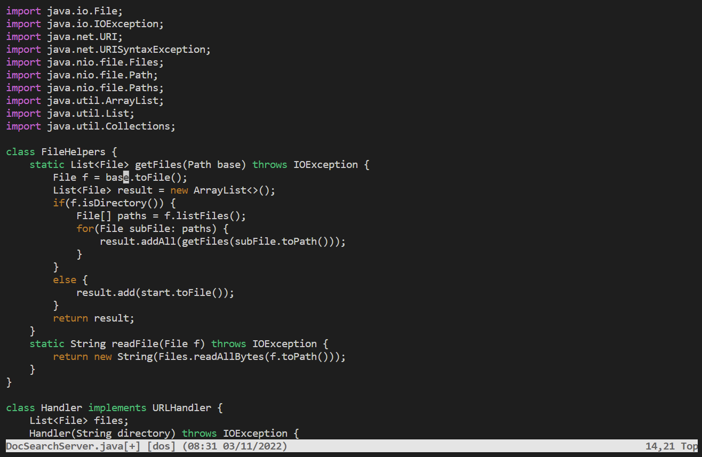
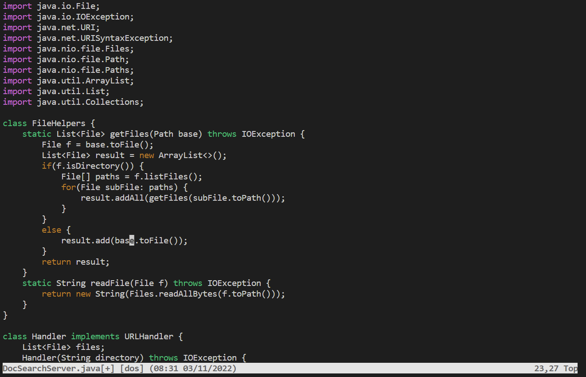
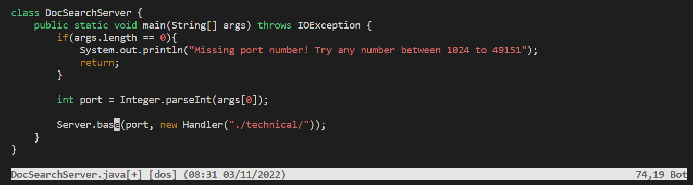

# Week 7 Lab Report  
## Part 1  
```
/start<Enter>cebase<Esc>n.n.n.
```  
  
This is a screenshot from after ```/start<Enter>``` which situates the cursor on the first letter of the word start.  

  
This is after ```cebase``` which replaces the word start with base.  

  
After the command ```<Esc>n.``` which exits insert mode and the n moves the cursor to the next occurrence of the word start. The period then calls the last command that was used.  

  
This is the second ```n.``` which scrolls to the third time start occurs and replaces it with base.  


With the final part of the command ```n.``` this does the same thing as above finds the next occurence of the word start and replaces it with base.    

## Part 2  
When editing the file and then using ```scp``` to copy it onto the remote computer took 70 seconds, while using vim and editing on the remote computer took 30 seconds. One difficulty that occurred when using ```scp``` was that I had some typos in the command and that caused a slight delay.  

I think that with a little more proficiency and experience with vim, that would definitely be the easiest way to edit files on a remote computer. Using vim eliminates the steps of copying files and loggining into ```ssh``` to verify that files were added correctly, thus making it a faster method most of the time. 

I think that one thing that would factor into my decision about which method I would use is the amount of work that I have to do on the file. If it requires creating a new file from scratch and adding a lot of code I would rather do this in VS code. VS code would make it easier for me because I am more experienced with it. If, on the other hand, I only needed to do small edits vim would be easier to quickly access and edit.
