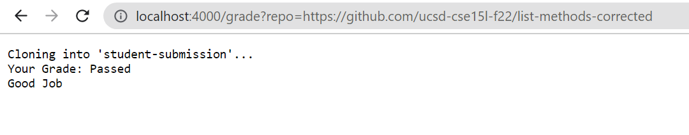
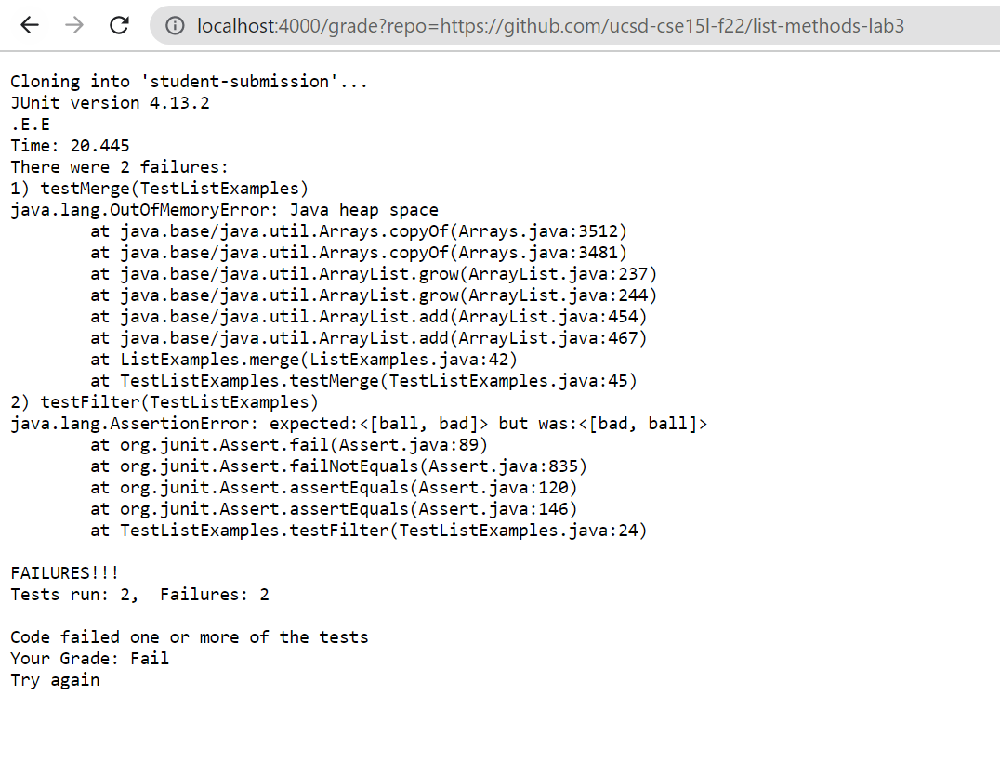
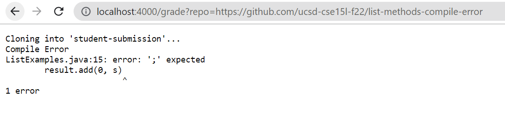

# Lab Report 5 - Week 9  
## grade.sh Code
```
rm -rf student-submission
git clone $1 student-submission

cp TestListExamples.java student-submission/
cp -r lib student-submission/
cd student-submission

if [[ -f ListExamples.java ]]
then
  javac -cp ".;lib/hamcrest-core-1.3.jar;lib/junit-4.13.2.jar" *.java 2> compile-error.txt

  if [[ $? -eq 0 ]]
  then
    java -cp ".;lib/junit-4.13.2.jar;lib/hamcrest-core-1.3.jar" org.junit.runner.JUnitCore TestListExamples > runtime-error.txt

    ERR=$(grep "FAILURES" runtime-error.txt)
    if [[ $ERR == "FAILURES!!!" ]]
    then
      cat runtime-error.txt
      echo "Code failed one or more of the tests"
      echo "Your Grade: Fail"
      echo "Try again"
      exit
    fi

    echo "Your Grade: Passed"
    echo "Good Job"
    exit
  fi

  echo "Compile Error"
  cat compile-error.txt
  exit
fi

echo "The file ListExamples.java was not found."
exit
```  

# Grade Script on Student Repositories
  
  
  

# Trace Through Grade Script  
For this trace throught the grade script I will pick the the first screenshot example. The repository is: https://github.com/ucsd-cse15l-f22/list-methods-corrected  

```bash grade.sh https://github.com/ucsd-cse15l-f22/list-methods-corrected```  

|Line|Command|Stdout|Stderr|Exit Code|
|----|-------|------|------|---------|
|5|```rm```| | |0|
|6|```git clone```| |Cloning into 'student-submission'...|0|
|8|```cp```| | |0|
|9|```cp```| | |0|
|10|```cd```| | |0|
|12|if statement|*This if statement evaluates to true becuase this repository does contain a file named ListExamples.java|| |
|14|```javac```| | |0|  
|16|if statement|*This evaluates to true since all the java files in the repository compile|| |  
|18|```java```| | |0|  
|20|variable| | |1|  
|21|if statement|*Evaluates to false since the JUnit output does not contain any failures.|*This causes all the commands inside the if statement not to run.
|23|```cat```|Does not run  
|24|```echo```|Does not run  
|25|```echo```|Does not run  
|26|```echo```|Does not run  
|27|```exit```|Does not run  
|30|```echo```|Your Grade: Passed| |0|  
|31|```echo```|Good Job| |0| 
|32|```exit```| | |1|  
|35|```echo```|Does not run  
|36|```cat```|Does not run  
|37| ```exit```|Does not run  
|40|```echo```|Does not run  
|41|```exit```|Does not run

*If any section is blank that means that there was not output for that section
